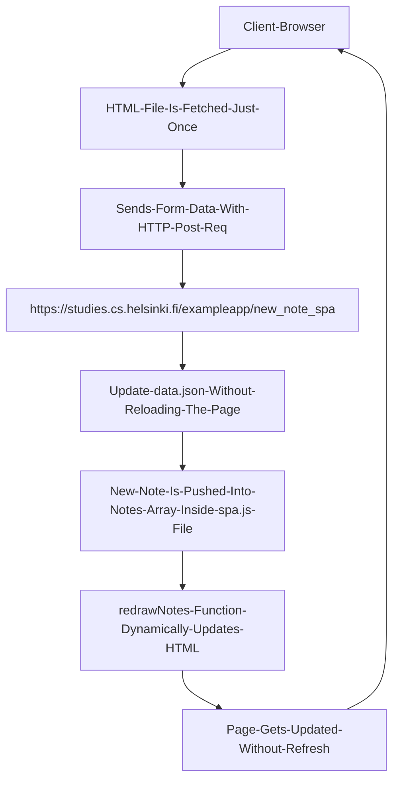

```mermaid
graph TD;
    Client-Browser --> HTML-File-Is-Fetched-Just-Once --> Sends-Form-Data-With-HTTP-Post-Req --> https://studies.cs.helsinki.fi/exampleapp/new_note_spa --> Update-data.json-Without-Reloading-The-Page --> New-Note-Is-Pushed-Into-Notes-Array-Inside-spa.js-File --> redrawNotes-Function-Dynamically-Updates-HTML --> Page-Gets-Updated-Without-Refresh --> Client-Browser
```